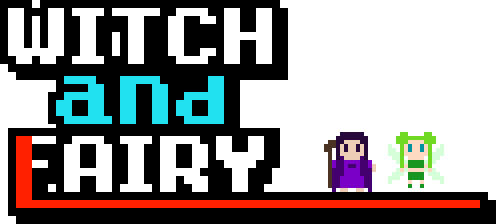

# WITCH&FAIRY

  

A game written in [m68k](https://en.wikipedia.org/wiki/Motorola_68000) assembly and using [EASy68K](http://www.easy68k.com/)'s graphical and I/O features.  
Made as a task for the [UIB](https://uib.eu).  
  
This game took inspiration from Witch & Hero.
